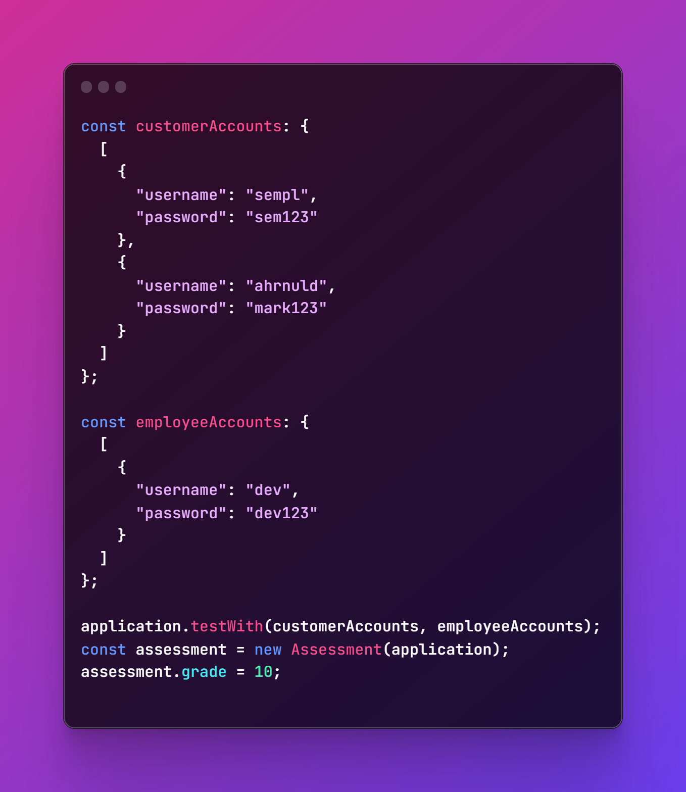

# WebDev2-EndAssignment

This is the frontend of Sem Plaatsman's final assignment for Web Development 2. The database creation script is in the REST-API folder.

## User accounts

[](https://ray.so/#code=Y29uc3QgY3VzdG9tZXJBY2NvdW50czogewogIFsKICAgIHsKICAgICAgInVzZXJuYW1lIjogInNlbXBsIiwKICAgICAgInBhc3N3b3JkIjogInNlbTEyMyIKICAgIH0sCiAgICB7CiAgICAgICJ1c2VybmFtZSI6ICJhaHJudWxkIiwKICAgICAgInBhc3N3b3JkIjogIm1hcmsxMjMiCiAgICB9CiAgXQp9OwoKY29uc3QgZW1wbG95ZWVBY2NvdW50czogewogIFsKICAgIHsKICAgICAgInVzZXJuYW1lIjogImRldiIsCiAgICAgICJwYXNzd29yZCI6ICJkZXYxMjMiCiAgICB9CiAgXQp9OwoKYXBwbGljYXRpb24udGVzdFdpdGgoY3VzdG9tZXJBY2NvdW50cywgZW1wbG95ZWVBY2NvdW50cyk7CmNvbnN0IGFzc2Vzc21lbnQgPSBuZXcgQXNzZXNzbWVudChhcHBsaWNhdGlvbik7CmFzc2Vzc21lbnQuZ3JhZGUgPSAxMDs&darkMode=true&background=true&theme=breeze&language=javascript)


## Project Setup

```sh
npm install
```

### Compile and Hot-Reload for Development

```sh
npm run dev
```